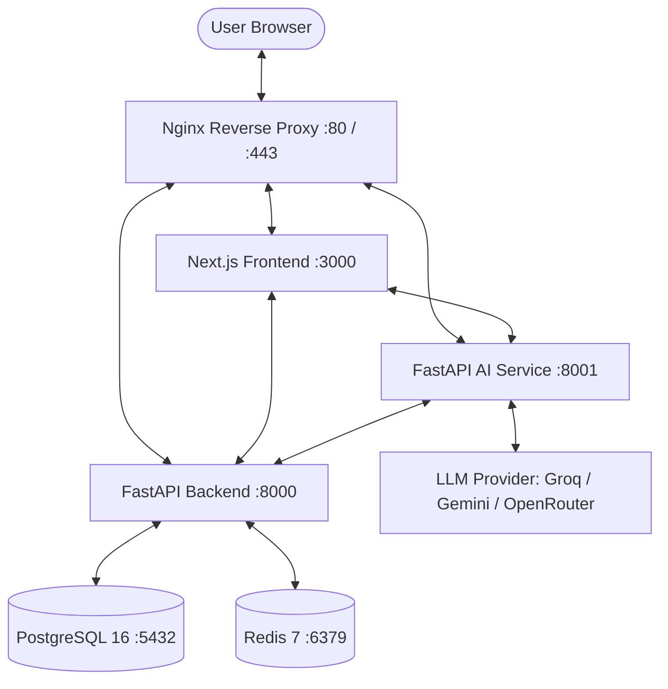
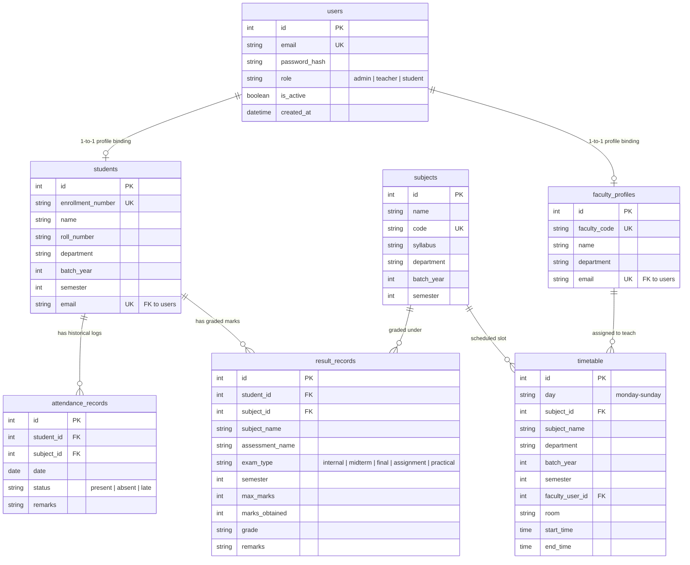

# 📚 SAMI (Student Management AI) — Complete Project Documentation

Welcome to the definitive system architecture documentation and developer handbook for SAMI (Student Management AI). SAMI is an enterprise-grade, microservices-orchestrated academic platform equipped with a context-aware natural-language AI co-pilot.

---

## 🏗️ 1. Architecture & Orchestration

SAMI is built as a highly decoupled microservices stack managed using Docker Compose, reverse-proxied via Nginx. This architecture guarantees high throughput, distinct separations of concerns, and clean service borders.

### 🌐 System Topography



### 🛰️ Network Orchestration Details
* **Nginx Router**: Acts as a central ingress controller on port 80. Routes paths `/` to Next.js, `/api/v1` to the Core Backend, and `/api/ai` to the AI service.
* **Service Discovery**: Docker Compose creates an isolated virtual bridge network where services communicate securely via internal DNS aliases (`backend`, `ai-service`, `db`, `redis`).
* **Cache & Rate-Limiting**: Redis acts as an ephemeral token blacklist cache and locks active routes to prevent coordinate query spamming.

---

## 📂 2. Project Directory Layout

```
student-management-ai/
├── backend/                # Core REST API (FastAPI)
│   ├── alembic/            # Database schema migration scripts
│   ├── app/
│   │   ├── core/           # Security configuration, hashing, DB engine sessions
│   │   ├── models/         # SQLAlchemy Declarative Models (PostgreSQL tables)
│   │   ├── routes/         # Endpoint sub-routers (Auth, Students, Timetable, Results, Query)
│   │   ├── schemas/        # Pydantic Schemas for payload request/response schemas
│   │   └── services/       # Core business logic & bulk importer operations
│   └── requirements.txt    # Backend Python package dependencies
├── ai-service/             # Context-Aware AI Engine (FastAPI)
│   ├── app/
│   │   ├── chains/         # Intent analyzers, router chains, slot compilers
│   │   ├── routes/         # Endpoint router (/query, /health)
│   │   └── services/       # LLM wrappers, security checks, state bindings
│   └── requirements.txt    # AI Service Python dependencies
├── frontend/               # Single-Page Web Dashboard (Next.js)
│   ├── components/         # Reusable React UI Blocks (AppLayout, Forms, Chat widgets)
│   │   ├── results/        # ResultManager upload modules
│   │   └── ui/             # Core visual layout elements (Cards, Badges, Tables)
│   ├── context/            # AuthContext hooks, localStorage state manager
│   ├── lib/                # API wrapper helpers (Axios instances), types declarations
│   └── pages/              # Routing nodes (Dashboard, Attendance, Timetable, Results)
├── docker/                 # Nginx configs, Dockerfiles, dev proxies
├── Makefile                # Unified developer CLI command orchestration
├── docker-compose.yml      # Development environment compose configuration
└── docker-compose.prod.yml # Production-grade optimized orchestration layout
```

---

## 🗃️ 3. Database Schema Layout

The persistent store is running on **PostgreSQL 16**. Data-integrity is strictly managed through SQL-level foreign key cascades, unique indexes, and explicit relational constraints.



---

## 🔐 4. Multi-Role RBAC System

Access privileges are rigorously partitioned into three distinct user classes. Endpoint routing and database interactions are governed through active JSON Web Tokens (JWT) payload extraction.

| Module | Administrative Role | Teacher Role | Student Role |
| :--- | :--- | :--- | :--- |
| **System Users** | Full CRUD | View Faculty Profiles | Hidden |
| **Departments & Subjects**| Full CRUD | Read-Only | Read-Only |
| **Student Directory** | Full CRUD | Department Roster Views | Self Profile Only |
| **Attendance Logs** | View All / Write | Create / Batch Mark | Self Attendance Only |
| **Result Uploads** | Full CRUD | Manage Designated Classes| Self Graded Cards Only |
| **Weekly Timetable** | Edit Planner Grid | Read / Class Slots View | Self Timetable View |
| **AI Copilot Context** | Institution-Wide Access | Department Filter Bound | Self Record Confined |

### 🔒 Secure Custom SQL Execution Layer (`backend/app/routes/query.py`)
To empower authorized users to ask complex aggregate queries (e.g., *"Show average student marks in CSE CS-101"*), an endpoint is exposed to execute database queries on demand. To prevent SQL injections or unauthorized leakage of private datasets, a strict RBAC regex engine has been engineered:

```python
# Regex-enforced restrictions on allowed query execution blocks:
SELECT_REGEX = re.compile(r"^\s*select\s", re.IGNORECASE)
FORBIDDEN_KEYWORDS = ["insert", "update", "delete", "drop", "truncate", "alter", "create", "grant", "revoke"]
SENSITIVE_TABLES = ["users", "audit_logs"]

# Security Policy Checks:
# 1. Students: Automatically forced to append a parameterized Student Profile filter:
#    query = query + " WHERE student_id = :student_id"
# 2. Teachers: Enforced to filter aggregated statistics strictly inside their assigned Department:
#    query = query + " WHERE department = :faculty_dept"
# 3. Tables: Explicitly rejects querying credentials ('users') or system audit records ('audit_logs').
```

---

## 🤖 5. Contextual AI Engineering

SAMI's AI service is driven by a state-of-the-art context injection pattern that keeps prompt tokens lean while personalizing responses.

### 👤 Role-Aware Dynamic Greeting & Contextual Prompting
When a user opens the "Ask Xplore" widget, the system extracts the logged-in metadata of the sender via API headers.
- **For Students**: The AI is pre-loaded with their unique academic overview, attendance metrics, and weaker subjects. The system addresses them as *"Hi, [Name]"*.
- **For Teachers**: The AI pre-loads their assigned department, schedule slots, and teaching metrics, addressing them respectfully as *"Hello, Professor [Name]"*.

### 🗓️ Interactive Timetable Slot Resolver
When a Teacher triggers an AI command to mark student attendance (e.g., *"mark everyone absent on May 6th"*), the prompt analyzer checks if a specific class schedule slot/subject ID was supplied. If missing, instead of failing or throwing an error, SAMI queries the teacher's active teaching schedule and prompts:
> **"You teach multiple subjects on this weekday. Which slot should I apply this to?"**
> - **[Slot ID 203]** CS-102 (Database Systems) at 10:30 AM
> - **[Slot ID 205]** CS-104 (Discrete Structures) at 1:30 PM
>
> *Type: "Mark Slot ID 203 present"*

---

## 🎨 6. Premium UI Layout & Features

SAMI's frontend is a fully responsive glassmorphism workspace built with Next.js 15.

### 🚀 "Ask Xplore" Pill Widget
Designed to be immediately noticeable and premium, the AI launcher sits on the bottom right of the layout:
* **The Shape**: A sleek, pill-shaped trigger button styled with a dark futuristic background gradient (`from-slate-950 via-slate-900 to-cyan-950`) and white border rings.
* **The Icon**: Custom dual-star vector layout mirroring high-end generative models, configured with a slow `duration-500` rotation micro-animation on hover.
* **Seamless Drawer**: Opens an animated collapsible panel containing chat memory, context selection pills, and immediate dynamic prompt starter cards.

### 📊 Results & Grade Management (ResultManager)
* Supports quick mark entry with immediate feedback validation.
* Replaced all internal numeric identifiers (Subject ID, Student ID) with friendly, readable, and department-sequenced strings:
  - Select student is labeled as **"Enrollment Number"** (displaying `[Enrollment Number] — [Name]`).
  - Select subject is labeled as **"Subject Code"** (displaying `[Subject Code] [Subject Name]`).

---

## ⚙️ 7. Environmental Variables & Configuration

Before deploying the SAMI stack, duplicate `.env.example` to create a local configuration file named `.env`:

```ini
# Core Backend Keys
JWT_SECRET=your_super_secure_jwt_secret_hex
ACCESS_TOKEN_EXPIRE_MINUTES=60
BACKEND_CORS_ORIGINS=["http://localhost:3000","http://localhost"]

# PostgreSQL Storage
POSTGRES_SERVER=db
POSTGRES_USER=sami_admin
POSTGRES_PASSWORD=your_database_password_here
POSTGRES_DB=sami_db

# Redis Ephemeral Caching
REDIS_HOST=redis
REDIS_PORT=6379

# AI Engine Orchestration
LLM_PROVIDER=gemini # Option list: "groq" | "gemini" | "openrouter"
GEMINI_API_KEY=your_google_gemini_token_here
GROQ_API_KEY=your_groq_llama_token_here
OPENROUTER_API_KEY=your_openrouter_api_token_here
```

---

## 🛠️ 8. Developer Workflows & Commands

SAMI features a comprehensive `Makefile` to simplify building, migrating, and bootstrapping tasks:

```bash
# Start dev docker containers in background
make up

# Apply latest relational database schema migrations
make migrate-upgrade

# Stop and remove container groups and network bridges
make down

# Seed over 100 mock students, attendance history, results, and timetables
docker compose exec backend python -m app.seed_sample_data --reset-sample

# Bootstrap the main Administrative security access profile (CLI equivalent)
curl -X POST http://localhost:8000/api/v1/auth/bootstrap-admin \
  -H "Content-Type: application/json" \
  -d '{"email":"admin@example.com","password":"StrongAdminPassword123!"}'
```

---

*This concludes the platform specifications handbook. For questions regarding system configurations, review the main endpoint docs at `/docs` on the Core API backend, or invoke **"Ask Xplore"** inside your running instance!*
