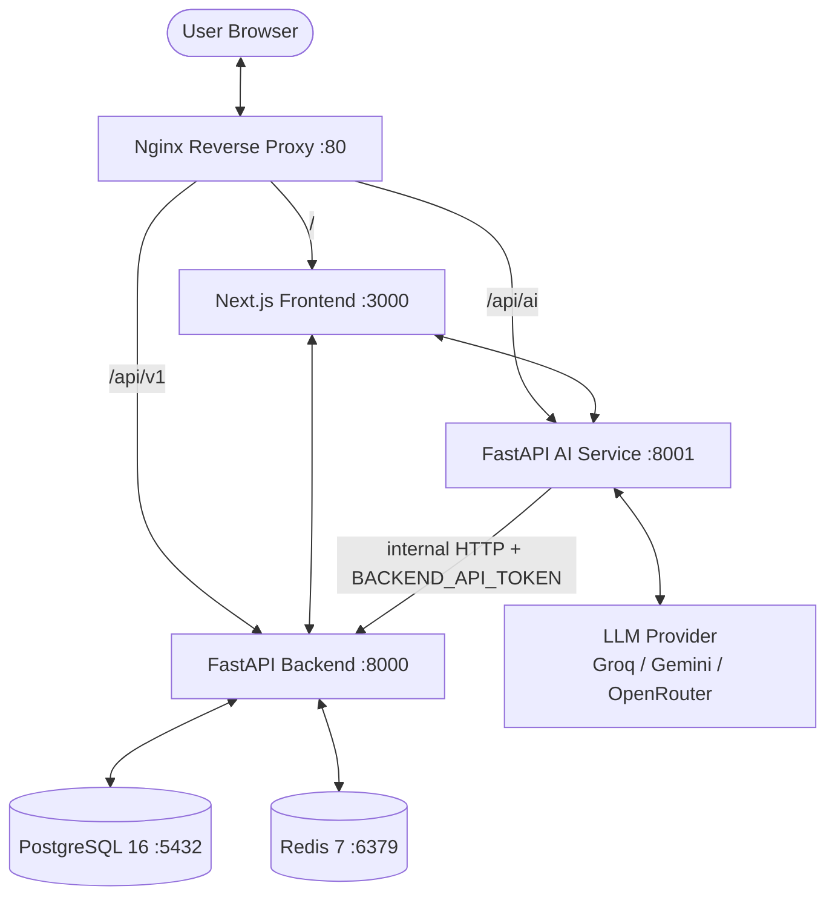
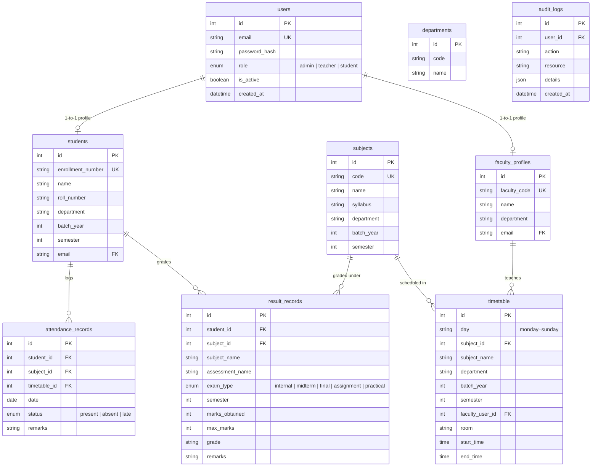

# SAMI — Complete Technical Documentation

This document is the definitive developer reference for SAMI (Student Management AI): architecture, database schema, API reference, authentication, RBAC, AI engine design, frontend structure, environment variables, deployment, and development workflows.

---

## Table of Contents

1. [System Architecture](#1-system-architecture)
2. [Project Directory Layout](#2-project-directory-layout)
3. [Database Schema](#3-database-schema)
4. [Authentication & Security](#4-authentication--security)
5. [RBAC — Role-Based Access Control](#5-rbac--role-based-access-control)
6. [API Reference](#6-api-reference)
7. [AI Service — Design & Data Flow](#7-ai-service--design--data-flow)
8. [Frontend — Component Structure](#8-frontend--component-structure)
9. [Environment Variables Reference](#9-environment-variables-reference)
10. [Docker & Deployment](#10-docker--deployment)
11. [Developer Workflows](#11-developer-workflows)
12. [Testing](#12-testing)
13. [Troubleshooting](#13-troubleshooting)

---

## 1. System Architecture

SAMI is a microservices application composed of six services orchestrated by Docker Compose and exposed through a single Nginx reverse proxy.

### Service Topology



### Nginx Routing Rules

| Path Prefix | Upstream | Notes |
| :--- | :--- | :--- |
| `/api/v1/` | `backend:8000` | Core REST API |
| `/api/ai/` | `ai-service:8001` | AI assistant endpoint |
| `/` | `frontend:3000` | Next.js application |

All services share an isolated Docker bridge network. Internal calls use DNS aliases (`backend`, `ai-service`, `db`, `redis`).

### Request Flow

1. Browser sends a request to Nginx on port 80.
2. Nginx inspects the path prefix and proxies to the appropriate upstream.
3. The Frontend (Next.js) communicates with both the Backend and the AI Service via browser-side `NEXT_PUBLIC_*` URLs or server-side Next.js rewrites.
4. The AI Service authenticates to the Backend using the `BACKEND_API_TOKEN` shared secret to fetch user data for context injection.
5. Backend validates every request against a JWT token, enforces RBAC, and persists or reads from PostgreSQL.
6. Redis handles in-memory rate limiting (login attempts, general requests) and session caching.

---

## 2. Project Directory Layout

```
student-management-ai/
│
├── backend/                         # Core REST API
│   ├── alembic/                     # Alembic migration scripts
│   │   └── versions/                # Individual schema revisions
│   ├── app/
│   │   ├── core/
│   │   │   ├── auth.py              # JWT token validation dependency
│   │   │   ├── security.py          # Password hashing (bcrypt), token creation
│   │   │   ├── config.py            # Pydantic settings loader
│   │   │   ├── database.py          # SQLAlchemy engine & session factory
│   │   │   ├── auth_middleware.py   # Request-level token injection middleware
│   │   │   ├── audit_middleware.py  # Mutation audit logging middleware
│   │   │   ├── permissions.py       # Role-permission mapping & enforcement
│   │   │   └── logging.py           # Loguru configuration
│   │   ├── models/                  # SQLAlchemy declarative models
│   │   │   ├── user.py
│   │   │   ├── student.py
│   │   │   ├── faculty.py
│   │   │   ├── subject.py
│   │   │   ├── department.py
│   │   │   ├── timetable.py
│   │   │   ├── attendance.py
│   │   │   ├── result.py
│   │   │   └── audit.py
│   │   ├── routes/                  # FastAPI routers
│   │   │   ├── auth.py
│   │   │   ├── students.py
│   │   │   ├── faculty.py
│   │   │   ├── subjects.py
│   │   │   ├── departments.py
│   │   │   ├── timetable.py
│   │   │   ├── attendance.py
│   │   │   ├── results.py
│   │   │   ├── overview.py
│   │   │   ├── query.py
│   │   │   ├── audit.py
│   │   │   └── health.py
│   │   ├── schemas/                 # Pydantic request/response models
│   │   ├── services/                # Business logic
│   │   │   ├── student_service.py
│   │   │   ├── faculty_service.py
│   │   │   ├── attendance_service.py
│   │   │   ├── timetable_service.py
│   │   │   ├── result_service.py
│   │   │   ├── department_service.py
│   │   │   └── overview_service.py
│   │   ├── main.py                  # App factory, router registration, middleware
│   │   └── seed_sample_data.py      # Demo data generator
│   └── requirements.txt
│
├── ai-service/                      # AI Academic Assistant
│   ├── app/
│   │   ├── agents/
│   │   │   └── backend_agent.py     # HTTP calls to backend API endpoints
│   │   ├── chains/
│   │   │   └── query_chain.py       # Intent analysis, routing, context injection
│   │   ├── core/
│   │   │   ├── config.py
│   │   │   ├── logging.py
│   │   │   └── rate_limit.py
│   │   ├── routes/
│   │   │   ├── assistant.py         # /query and /ai endpoints
│   │   │   └── health.py
│   │   ├── schemas/
│   │   │   └── assistant.py         # AssistantQuery schema
│   │   ├── services/
│   │   │   ├── llm_client.py        # LLM provider abstraction
│   │   │   └── rag.py               # Context retrieval (RAG)
│   │   ├── tools/
│   │   │   ├── attendance_tool.py   # Attendance math utilities
│   │   │   └── grade_tool.py        # Grade/result utilities
│   │   └── main.py
│   └── requirements.txt
│
├── frontend/                        # Next.js 15 Web App
│   ├── components/
│   │   ├── AppLayout.tsx            # Root layout shell with sidebar
│   │   ├── ChatInterface.tsx        # AI chat panel
│   │   ├── GlobalAssistantWidget.tsx # "Ask Xplore" pill launcher
│   │   ├── dashboard/
│   │   │   ├── DashboardHome.tsx
│   │   │   └── widgets.tsx
│   │   ├── results/
│   │   │   └── ResultManager.tsx
│   │   └── ui.tsx                   # Core UI primitives
│   ├── context/
│   │   └── AuthContext.tsx          # JWT auth state & user context
│   ├── lib/                         # Axios instances, type declarations
│   ├── pages/
│   │   ├── _app.tsx
│   │   ├── login.tsx
│   │   ├── signup.tsx
│   │   ├── dashboard.tsx
│   │   ├── attendance.tsx
│   │   ├── results.tsx
│   │   ├── timetable.tsx
│   │   ├── students.tsx
│   │   ├── faculty.tsx
│   │   ├── subjects.tsx
│   │   ├── departments/[department].tsx
│   │   ├── admin/users.tsx
│   │   └── health.tsx
│   ├── styles/
│   ├── next.config.mjs
│   └── package.json
│
├── docker/
│   ├── nginx.conf
│   ├── frontend.Dockerfile
│   ├── backend.Dockerfile
│   └── ai-service.Dockerfile
│
├── .env.example
├── docker-compose.yml
├── docker-compose.prod.yml
└── Makefile
```

---

## 3. Database Schema

The primary datastore is **PostgreSQL 16**. Schema migrations are managed with **Alembic**.

### Entity-Relationship Diagram



### Key Constraints

- `users.email` — globally unique
- `students.enrollment_number` — unique per institution
- `students.(department, roll_number)` — compound unique
- `faculty_profiles.faculty_code` — unique per institution
- `subjects.code` — unique per institution
- All foreign keys are enforced with cascade rules for referential integrity

---

## 4. Authentication & Security

### Authentication Flow

```
1.  POST /auth/login  { email, password }
2.  Backend verifies password against bcrypt hash
3.  Backend creates JWT: { sub: email, role: "student|teacher|admin", exp: +60min }
4.  Frontend stores token in localStorage ("auth_token")
5.  All subsequent requests include: Authorization: Bearer <token>
6.  TokenValidationMiddleware decodes JWT on every request
7.  Decoded user (id, email, role) is attached to request.state
8.  Route handlers read request.state.user for identity and RBAC checks
```

### JWT Token Structure

```json
{
  "sub": "user@example.com",
  "role": "student",
  "exp": 1746580000
}
```

Algorithm: `HS256`. Expiry: configurable via `ACCESS_TOKEN_EXPIRE_MINUTES` (default 60).

### Password Security

- Stored as bcrypt hashes (never plaintext).
- Minimum length enforced via `MIN_PASSWORD_LENGTH` (default 8).
- Password validation occurs only at the application layer.

### Rate Limiting

Implemented as an in-memory Redis-backed limiter:

| Endpoint | Limit | Window |
| :--- | :--- | :--- |
| `POST /auth/login` | 10 attempts | 60 seconds |
| All other endpoints | 240 requests | 60 seconds |

Limits are configurable via environment variables (`LOGIN_RATE_LIMIT_*`, `REQUEST_RATE_LIMIT_*`).

### Internal Service Authentication

The AI service calls the Backend API using a shared `BACKEND_API_TOKEN` (Bearer token) to fetch user data for AI context. This token must match on both sides.

### Bootstrap Admin

`POST /auth/bootstrap-admin` creates the first admin account. It is a one-time operation — after the first admin exists, this endpoint returns an error and cannot be re-used.

---

## 5. RBAC — Role-Based Access Control

### Permission Matrix

| Resource / Action | Admin | Teacher | Student |
| :--- | :---: | :---: | :---: |
| **Users** — Create / Delete | Yes | No | No |
| **Users** — View all | Yes | Faculty profiles only | No |
| **Departments** — CRUD | Yes | Read | Read |
| **Subjects** — CRUD | Yes | Read | Read |
| **Students** — Full CRUD | Yes | Read (own dept) | Self only |
| **Faculty** — Full CRUD | Yes | Read | Read |
| **Attendance** — View all | Yes | Own subjects | Own records |
| **Attendance** — Mark / Edit | Yes | Own subjects | No |
| **Results** — View | Yes | Own subjects | Own records |
| **Results** — Upload / Edit | Yes | Own subjects | No |
| **Timetable** — Edit | Yes | No | No |
| **Timetable** — View | Yes | Yes | Own semester |
| **Audit Logs** — View | Yes | No | No |
| **Custom SQL** — Execute | Yes | Dept-filtered SELECT | Self-filtered SELECT |
| **AI Context Scope** | Institution-wide | Department-filtered | Self only |

### Secure SQL Execution Layer

The `POST /query` endpoint allows authorized users to run read-only analytics. Security is enforced at the application layer:

```python
# Only SELECT statements are permitted
SELECT_REGEX = re.compile(r"^\s*select\s", re.IGNORECASE)

# These keywords are blocked outright
FORBIDDEN_KEYWORDS = ["insert", "update", "delete", "drop",
                      "truncate", "alter", "create", "grant", "revoke"]

# These tables are never queryable
SENSITIVE_TABLES = ["users", "audit_logs"]

# Row-level scoping by role
# Students  → query += " WHERE student_id = :current_student_id"
# Teachers  → query += " WHERE department = :faculty_department"
# Admins    → unrestricted (SELECT only, no sensitive tables)
```

---

## 6. API Reference

All backend routes are prefixed with `/api/v1` through Nginx (or hit directly on port 8000 during local dev).

Interactive API docs: **[http://localhost:8000/docs](http://localhost:8000/docs)**

### Authentication

| Method | Path | Auth | Description |
| :--- | :--- | :--- | :--- |
| POST | `/auth/login` | None | Email/password login → returns JWT |
| GET | `/auth/me` | JWT | Get current user profile |
| GET | `/auth/permissions` | JWT | Get allowed operations for current user |
| POST | `/auth/users` | Admin | Create a new user account |
| POST | `/auth/bootstrap-admin` | None | Create first admin (one-time only) |

### Students

| Method | Path | Auth | Description |
| :--- | :--- | :--- | :--- |
| GET | `/students/` | JWT | List students (admin: all; teacher: dept; student: self) |
| POST | `/students/` | Admin | Create student profile |
| GET | `/students/{id}` | JWT | Get student by ID |
| PUT | `/students/{id}` | Admin | Update student |
| DELETE | `/students/{id}` | Admin | Delete student |
| POST | `/students/bulk-import` | Admin | Import students from `.xlsx` file |
| GET | `/students/search` | JWT | Search students by name / enrollment number |

### Faculty

| Method | Path | Auth | Description |
| :--- | :--- | :--- | :--- |
| GET | `/faculty/` | JWT | List faculty profiles |
| POST | `/faculty/` | Admin | Create faculty profile |
| GET | `/faculty/{id}` | JWT | Get faculty by ID |
| PUT | `/faculty/{id}` | Admin | Update faculty |
| DELETE | `/faculty/{id}` | Admin | Delete faculty |

### Departments & Subjects

| Method | Path | Auth | Description |
| :--- | :--- | :--- | :--- |
| GET | `/departments/` | JWT | List all departments |
| POST | `/departments/` | Admin | Create department |
| GET | `/subjects/` | JWT | List subjects |
| POST | `/subjects/` | Admin | Create subject |
| PUT | `/subjects/{id}` | Admin | Update subject |
| DELETE | `/subjects/{id}` | Admin | Delete subject |

### Timetable

| Method | Path | Auth | Description |
| :--- | :--- | :--- | :--- |
| GET | `/timetable/` | JWT | Get timetable (filtered by role) |
| POST | `/timetable/` | Admin | Create timetable slot |
| PUT | `/timetable/{id}` | Admin | Update slot |
| DELETE | `/timetable/{id}` | Admin | Delete slot |

### Attendance

| Method | Path | Auth | Description |
| :--- | :--- | :--- | :--- |
| GET | `/attendance/` | JWT | Get attendance records (role-filtered) |
| POST | `/attendance/` | Teacher/Admin | Mark attendance for a session |
| POST | `/attendance/bulk` | Teacher/Admin | Bulk mark attendance from array |
| GET | `/attendance/summary` | JWT | Get per-subject attendance percentages |

### Results

| Method | Path | Auth | Description |
| :--- | :--- | :--- | :--- |
| GET | `/results/` | JWT | Get result records (role-filtered) |
| POST | `/results/` | Teacher/Admin | Create result entry |
| PUT | `/results/{id}` | Teacher/Admin | Update result |
| DELETE | `/results/{id}` | Admin | Delete result |
| POST | `/results/bulk-import` | Teacher/Admin | Import results from `.xlsx` |

### Analytics & Admin

| Method | Path | Auth | Description |
| :--- | :--- | :--- | :--- |
| GET | `/overview/` | JWT | Dashboard KPIs and summary statistics |
| POST | `/query/` | JWT | Execute RBAC-enforced SELECT query |
| GET | `/audit/` | Admin | View audit log entries |

### Health Checks

| Method | Path | Description |
| :--- | :--- | :--- |
| GET | `/health/live` | Liveness check — returns `{ "status": "ok" }` |
| GET | `/health/ready` | Readiness check — verifies DB and Redis connectivity |

### AI Service Endpoints

Base URL: `http://localhost:8001` (or `/api/ai/` through Nginx)

| Method | Path | Auth | Description |
| :--- | :--- | :--- | :--- |
| POST | `/ai/query` | JWT | Submit natural language query to AI assistant |
| GET | `/health/live` | None | AI service liveness check |
| GET | `/health/ready` | None | AI service readiness check |

**AI Query Request Body:**
```json
{
  "query": "What are my weakest subjects this semester?",
  "conversation_history": [
    { "role": "user", "content": "..." },
    { "role": "assistant", "content": "..." }
  ],
  "execute": false
}
```

**AI Query Response:**
```json
{
  "response": "Based on your grades, your weakest subject is...",
  "action": null,
  "context_sources": ["results", "attendance"]
}
```

When `execute: true` and the AI generates an actionable command (e.g., mark attendance), the `action` field contains a pre-structured payload for the teacher to confirm before execution.

---

## 7. AI Service — Design & Data Flow

### Overview

The AI service is a stateless FastAPI microservice that wraps an LLM with role-aware context injection. It does not maintain conversation history server-side — the client sends the full conversation history with each request.

### Query Processing Pipeline

```
1. Receive AssistantQuery (query + history + user JWT)
2. Decode JWT to identify user (role, id, email)
3. Call backend_agent to fetch relevant context:
   - Student: own profile, attendance summary, results, timetable
   - Teacher: department roster, assigned subjects, schedule
   - Admin: institution-wide overview stats
4. Inject context into LLM system prompt
5. Analyze intent using SYSTEM_PROMPT → structured action JSON
   e.g., { "action": "fetch_attendance", "params": {...} }
6. If action requires additional data, call backend again
7. Build final context payload
8. Call LLM with CHAT_SYSTEM_PROMPT + context + user query + history
9. Parse response: extract natural language answer + optional actionable command
10. Return response to frontend
```

### Intent Actions

| Action Key | Description | Roles |
| :--- | :--- | :--- |
| `fetch_attendance` | Attendance history & percentages | All |
| `fetch_results` | Grade records | All |
| `fetch_timetable` | Weekly schedule | All |
| `fetch_directory` | Student/faculty listing | Teacher, Admin |
| `fetch_overview` | Institution stats | Admin |
| `fetch_org_structure` | Departments and subjects | All |
| `mark_attendance` | Generate attendance-mark action | Teacher |
| `execute_sql` | Generate analytics SQL query | Admin |

### LLM Provider Abstraction

`services/llm_client.py` wraps three providers behind a uniform interface:

| Provider | Env Key | Default Model |
| :--- | :--- | :--- |
| OpenRouter | `OPENROUTER_API_KEY` | `google/gemini-flash-1.5` |
| Groq | `GROQ_API_KEY` | `llama-3.3-8b-versatile` |
| Google Gemini | `GEMINI_API_KEY` | `gemini-1.5-flash` |

Switch providers by changing `LLM_PROVIDER` in `.env` — no code changes required.

### Timetable Slot Disambiguation

When a teacher asks to mark attendance without specifying a subject, the AI detects the ambiguity and responds with a slot selector:

> "You teach multiple subjects on Monday. Which slot should I apply this to?"
> - **[Slot 203]** CS-102 Database Systems at 10:30 AM
> - **[Slot 205]** CS-104 Discrete Structures at 1:30 PM

This prevents silent misapplication to the wrong class.

---

## 8. Frontend — Component Structure

### Pages and Routes

| Route | File | Access | Description |
| :--- | :--- | :--- | :--- |
| `/login` | `pages/login.tsx` | Public | Email/password login |
| `/signup` | `pages/signup.tsx` | Public | User registration (admin-provisioned only) |
| `/dashboard` | `pages/dashboard.tsx` | All roles | Role-specific KPI dashboard |
| `/attendance` | `pages/attendance.tsx` | All roles | Attendance view / mark |
| `/results` | `pages/results.tsx` | All roles | Grade view / entry |
| `/timetable` | `pages/timetable.tsx` | All roles | Weekly schedule |
| `/students` | `pages/students.tsx` | Admin, Teacher | Student directory |
| `/faculty` | `pages/faculty.tsx` | All roles | Faculty directory |
| `/subjects` | `pages/subjects.tsx` | All roles | Subject catalogue |
| `/departments/[department]` | `pages/departments/[department].tsx` | All roles | Department detail view |
| `/admin/users` | `pages/admin/users.tsx` | Admin | User account management |
| `/health` | `pages/health.tsx` | Internal | Frontend health check |

### Key Components

**`AppLayout.tsx`** — Root layout shell. Renders sidebar navigation with role-filtered links, top bar, and wraps all authenticated pages.

**`GlobalAssistantWidget.tsx`** — The "Ask Xplore" pill button fixed at the bottom-right of every authenticated page. Opens the chat drawer on click.

**`ChatInterface.tsx`** — Full AI chat panel. Manages conversation history, sends queries to the AI service, renders markdown responses, and displays actionable command approval prompts for teachers.

**`DashboardHome.tsx`** — Renders KPI tiles from the `/overview` endpoint. Links tile titles to the corresponding data pages for drill-down.

**`ResultManager.tsx`** — Grade entry component. Uses enrollment numbers and subject codes (not raw IDs) in dropdowns for readability.

**`ui.tsx`** — Shared primitives: Card, Badge, Table, Spinner, Modal.

### Auth State (AuthContext)

`context/AuthContext.tsx` provides:

```typescript
const { user, token, login, logout, isLoading } = useAuth();
```

- `user` — decoded JWT payload (`{ email, role, id }`)
- `token` — raw JWT string from localStorage
- `login(email, password)` — calls `/auth/login`, stores token, sets user state
- `logout()` — clears localStorage and resets state
- All Axios instances in `lib/` automatically attach the token via a request interceptor

---

## 9. Environment Variables Reference

Copy `.env.example` to `.env` before running the stack. All services read from the same root `.env` file via Docker Compose `env_file`.

### Backend Variables

| Variable | Default | Description |
| :--- | :--- | :--- |
| `POSTGRES_DB` | `student_management` | PostgreSQL database name |
| `POSTGRES_USER` | `student_admin` | PostgreSQL username |
| `POSTGRES_PASSWORD` | — | PostgreSQL password (required) |
| `DATABASE_URL` | — | Full connection string: `postgresql+psycopg2://user:pass@db:5432/dbname` |
| `REDIS_URL` | `redis://redis:6379/0` | Redis connection string |
| `JWT_SECRET` | — | Secret for HS256 JWT signing (required, keep secret) |
| `ACCESS_TOKEN_EXPIRE_MINUTES` | `60` | JWT lifetime in minutes |
| `MIN_PASSWORD_LENGTH` | `8` | Minimum password length |
| `AUTO_CREATE_TABLES` | `false` | Skip Alembic and auto-create tables (not recommended) |
| `BACKEND_CORS_ORIGINS` | `http://localhost:3000,...` | Comma-separated allowed CORS origins |
| `BACKEND_API_TOKEN` | — | Shared secret for AI service → Backend calls |
| `CLASS_DURATION_MINUTES` | `45` | Default duration for a class slot |
| `ATTENDANCE_TARGET_PERCENT` | `75` | Threshold below which attendance is flagged |
| `UPLOAD_MAX_BYTES` | `5000000` | Max file size for bulk imports (bytes) |
| `LOGIN_RATE_LIMIT_COUNT` | `10` | Max login attempts per window |
| `LOGIN_RATE_LIMIT_WINDOW_SECONDS` | `60` | Login rate limit window (seconds) |
| `REQUEST_RATE_LIMIT_COUNT` | `240` | Max general requests per window |
| `REQUEST_RATE_LIMIT_WINDOW_SECONDS` | `60` | General rate limit window (seconds) |

### AI Service Variables

| Variable | Default | Description |
| :--- | :--- | :--- |
| `LLM_PROVIDER` | `openrouter` | LLM backend: `groq`, `gemini`, or `openrouter` |
| `LLM_MODEL` | `google/gemini-flash-1.5` | Model identifier for the chosen provider |
| `OPENROUTER_API_KEY` | — | API key for OpenRouter |
| `GROQ_API_KEY` | — | API key for Groq |
| `GEMINI_API_KEY` | — | API key for Google Gemini |
| `BACKEND_URL` | `http://backend:8000` | Internal URL the AI service uses to call the backend |
| `BACKEND_API_TOKEN` | — | Must match the backend's `BACKEND_API_TOKEN` |

### Frontend Variables

| Variable | Default | Description |
| :--- | :--- | :--- |
| `NEXT_PUBLIC_BACKEND_URL` | `http://localhost:8000` | Backend URL visible to the browser |
| `NEXT_PUBLIC_AI_SERVICE_URL` | `http://localhost:8001/ai` | AI service URL visible to the browser |
| `BACKEND_PROXY_TARGET` | `http://backend:8000` | Next.js server-side proxy target for backend |
| `AI_PROXY_TARGET` | `http://ai-service:8001` | Next.js server-side proxy target for AI service |

---

## 10. Docker & Deployment

### Development Stack (`docker-compose.yml`)

Starts all six services with hot-reload enabled for the backend and AI service (`uvicorn --reload`), and Next.js dev server for the frontend.

```bash
make up          # Start in background
make logs        # Stream logs
make down        # Stop and remove
```

Service startup order (enforced by health checks):
`db` and `redis` → `backend` and `ai-service` → `frontend` → `nginx`

### Production Stack (`docker-compose.prod.yml`)

Uses optimized builds: Gunicorn workers for the Python services, `npm run build` + static export or `next start` for the frontend. The production compose file mounts production-grade Nginx config with SSL termination placeholders.

```bash
make up-prod
make down-prod
make logs-prod
```

### Database Migrations

Migrations are managed with **Alembic** and run automatically on backend container startup:

```bash
# Generate a new migration from model changes
make migrate-create

# Apply pending migrations
make migrate-upgrade
```

The `alembic/versions/` directory stores all revision files. Never delete or edit existing revisions — always generate new ones.

### Health Checks

Each service exposes health endpoints that Docker uses to determine readiness:

| Service | Endpoint | Interval |
| :--- | :--- | :--- |
| Backend | `GET /health/live` | 10s |
| AI Service | `GET /health/live` | 10s |
| Frontend | `GET /health` | 10s |
| PostgreSQL | `pg_isready` | 10s |
| Redis | `redis-cli ping` | 10s |

---

## 11. Developer Workflows

### Full Makefile Reference

```bash
make up                 # Start dev stack (background)
make down               # Stop dev stack
make build              # Rebuild all images (no cache reset)
make logs               # Tail logs from all services
make ps                 # Show container statuses

make up-prod            # Start production stack
make down-prod          # Stop production stack
make logs-prod          # Tail production logs

make migrate-create     # Alembic autogenerate migration
make migrate-upgrade    # Apply all pending migrations

make backend-tests      # Run backend pytest suite
make ai-tests           # Run AI service pytest suite

make fmt                # ruff check --fix + ruff format (backend)
make lint               # ruff check (backend, no auto-fix)

make bootstrap-admin    # Create first admin (reads BOOTSTRAP_ADMIN_EMAIL/PASSWORD env vars)
```

### Seeding Sample Data

```bash
# Seeds 100+ students, faculty, subjects, attendance, results, timetables
docker compose exec backend python -m app.seed_sample_data --reset-sample
```

The `--reset-sample` flag clears any previous sample data before re-seeding.

### Adding a New API Endpoint

1. Define the Pydantic schema in `backend/app/schemas/`.
2. Add service logic in `backend/app/services/`.
3. Create or update the route in `backend/app/routes/`.
4. Register the router in `backend/app/main.py`.
5. Run `make migrate-create` if a model change is involved, then `make migrate-upgrade`.

### Adding a New Frontend Page

1. Create the file in `frontend/pages/`.
2. Wrap with `<AppLayout>` if it is an authenticated page.
3. Use `useAuth()` to gate by role as needed.
4. Add a link to `AppLayout.tsx` sidebar navigation.

---

## 12. Testing

### Backend Tests

```bash
make backend-tests
# or: docker compose run --rm backend pytest
```

Tests live in `backend/tests/`. The suite uses pytest with FastAPI's `TestClient`.

### AI Service Tests

```bash
make ai-tests
# or: docker compose run --rm ai-service pytest
```

### Linting

```bash
make lint        # Check only
make fmt         # Check + auto-fix + format
```

Both use **ruff** for Python linting and formatting (configured in `pyproject.toml` or `ruff.toml`).

---

## 13. Troubleshooting

### 502 Bad Gateway

Nginx is routing to an upstream that has not finished starting. Run `make ps` and wait for all services to show `healthy`. This typically takes 30–60 seconds on first run while PostgreSQL initializes and Alembic migrations run.

### AI Service Returns Empty Responses

1. Check `LLM_PROVIDER` and the corresponding API key in `.env`.
2. Run `make logs` and look for `ai-service` — LLM API errors are logged at the request level.
3. Ensure `BACKEND_API_TOKEN` matches between the backend and AI service.
4. Verify `BACKEND_URL=http://backend:8000` (internal Docker DNS, not localhost).

### CORS Errors

`BACKEND_CORS_ORIGINS` must exactly match the URL in your browser's address bar (protocol + host + port). Example: `http://localhost:3000`. Update `.env` and restart the backend.

### Database Migration Failures

If a migration fails partway:
1. Check the error in `make logs`.
2. Fix the model or migration file.
3. If the database is in a broken state, connect directly: `docker compose exec db psql -U student_admin -d student_management` and inspect `alembic_version`.
4. Never delete migration files — create a new corrective migration.

### Frontend Hot Reload Not Working

In Docker dev mode, the frontend volume mounts `./frontend:/app`. If node_modules are stale, run `make build` to rebuild the frontend image with a fresh `npm install`.

### Bootstrap Admin Already Exists Error

The `/auth/bootstrap-admin` endpoint is a one-time setup. If you need to reset, connect to PostgreSQL and delete the admin user: `DELETE FROM users WHERE role = 'admin';` — then re-run the bootstrap. **Warning:** this deletes all admin accounts.

### Redis Connection Refused

The `redis` service may not be running. Check `make ps`. If Redis is unhealthy, inspect `make logs` for the redis service. Rate limiting degrades gracefully (logs warnings) if Redis is unavailable, so the app remains functional.
