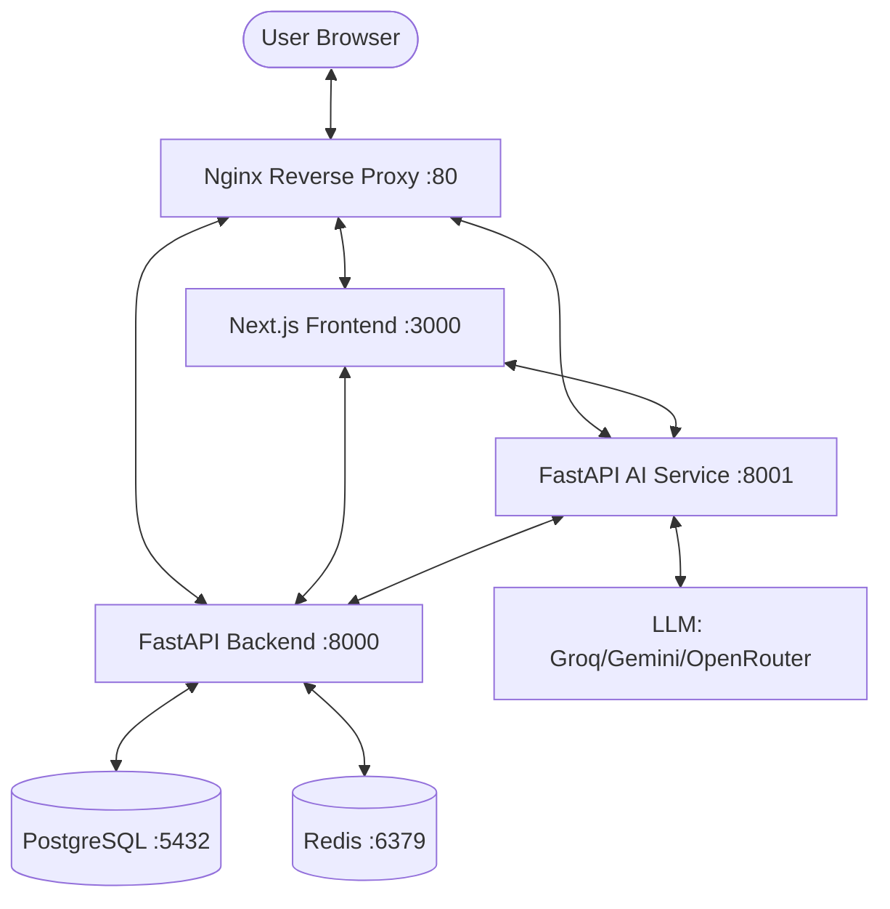

# Student Management AI (SAMI)

A professional, enterprise-ready **Student Management System** integrated with a natural-language **AI Academic Assistant**. Designed for modern institutions to manage rosters, attendance, results, and timetables through a unified, role-aware dashboard.

---

## 🏗️ Architecture

SAMI follows a modern microservices architecture, orchestrated with Docker Compose.



---

## ✨ Key Features

### 🔐 Multi-Role Access Control (RBAC)
- **Admins**: Institution-wide management, user provisioning, bulk data imports, and system audit logs.
- **Teachers**: Mark attendance, manage subject-specific results, view department rosters, and utilize the AI Assistant for operational tasks.
- **Students**: Personal dashboard with attendance tracking, result history, weekly timetable, and academic support via AI.

### 🤖 AI Academic Assistant
- **Context-Aware**: Knows who you are and which students/subjects you manage.
- **Natural Language Queries**: "Show weak subjects for student X," "Summarize attendance risk for this semester."
- **Actionable Commands**: Prepares structured operations (like marking attendance) for teacher approval.
- **Provider Support**: Swappable LLM backends including **Groq (Llama 3.3)**, **Google Gemini**, and **OpenRouter**.

### 📊 Academic Operations
- **Bulk Import**: Rapidly provision student records from `.xlsx` files.
- **Dynamic Timetable**: Automated clash-aware timetable management.
- **Analytics Dashboards**: High-level metrics for admins and personal snapshots for students.
- **Audit Logs**: Comprehensive tracking of all data mutations and AI interactions.

---

## 🛠️ Tech Stack

| Layer | Technology |
| :--- | :--- |
| **Frontend** | Next.js 15, React, Tailwind CSS, Axios, Lucide Icons |
| **Backend API** | FastAPI (Python), SQLAlchemy, Pydantic, Alembic |
| **AI Engine** | FastAPI, LangChain, OpenAI/Groq/Gemini SDKs |
| **Database** | PostgreSQL 16 (Relational data & Audit logs) |
| **Cache/Queue** | Redis 7 (Rate limiting, session caching) |
| **Infrastructure** | Docker, Nginx, Makefile, WSL2 Support |

---

## 🚀 Quick Start (Docker)

### 1. Environment Setup
Clone the repository and copy the example environment file:
```bash
cp .env.example .env
```

Open `.env` and configure your API keys and secrets:
- `JWT_SECRET`: Generate a secure random string.
- `LLM_PROVIDER`: Set to `groq`, `gemini`, or `openrouter`.
- `GROQ_API_KEY` / `GEMINI_API_KEY`: Add your respective provider key.

### 2. Launch the Stack
Use the provided `Makefile` for convenience:
```bash
make up
```
*Or via Docker directly:* `docker compose up -d --build`

### 3. Bootstrap the System
Create the first Administrative account (only works on fresh installations):
```bash
# Windows (PowerShell)
Invoke-RestMethod -Method Post http://localhost:8000/auth/bootstrap-admin `
  -ContentType "application/json" `
  -Body '{"email":"admin@example.com","password":"ChangeMe123!"}'

# Linux/macOS (curl)
curl -X POST http://localhost:8000/auth/bootstrap-admin \
  -H "Content-Type: application/json" \
  -d '{"email":"admin@example.com","password":"ChangeMe123!"}'
```

### 4. Load Demo Data (Optional)
To see the system in action with 100+ records, faculties, and historical data:
```bash
make migrate-upgrade
docker compose exec backend python -m app.seed_sample_data --reset-sample
```

---

## 💻 Manual Setup (Local Development)

If you prefer to run services outside of Docker:

**Backend & AI Service:**
```bash
cd backend # or cd ai-service
python -m venv venv
source venv/bin/activate  # venv\Scripts\activate on Windows
pip install -r requirements.txt
uvicorn app.main:app --reload --port 8000 # or 8001
```

**Frontend:**
```bash
cd frontend
npm install
npm run dev
```

---

## 📖 API Documentation

- **Backend REST API**: [http://localhost:8000/docs](http://localhost:8000/docs)
- **AI Service Health**: [http://localhost:8001/health/live](http://localhost:8001/health/live)

---

## 🛠️ Makefile Commands Reference

| Command | Description |
| :--- | :--- |
| `make up` | Start development containers in background |
| `make down` | Stop all containers and remove networks |
| `make build` | Rebuild all service images |
| `make logs` | Follow logs for all services |
| `make migrate-upgrade` | Apply database schema updates |
| `make up-prod` | Start production stack (Nginx + Optimized builds) |
| `make bootstrap-admin` | Trigger initial admin creation |

---

## ❓ Troubleshooting

- **502 Bad Gateway**: Usually means Nginx is up but the upstream service (Frontend or Backend) hasn't finished starting yet. Wait 30 seconds and refresh.
- **Frontend Build Failure**: If you see "Could not find a production build," ensure you are running in `dev` mode for local work or that `npm run build` completed successfully in the Docker container.
- **CORS Errors**: Verify that `BACKEND_CORS_ORIGINS` in your `.env` includes the exact URL you are accessing the frontend from.

---

## 📝 License
This project is for educational/internal use. See the repository license for full details.
