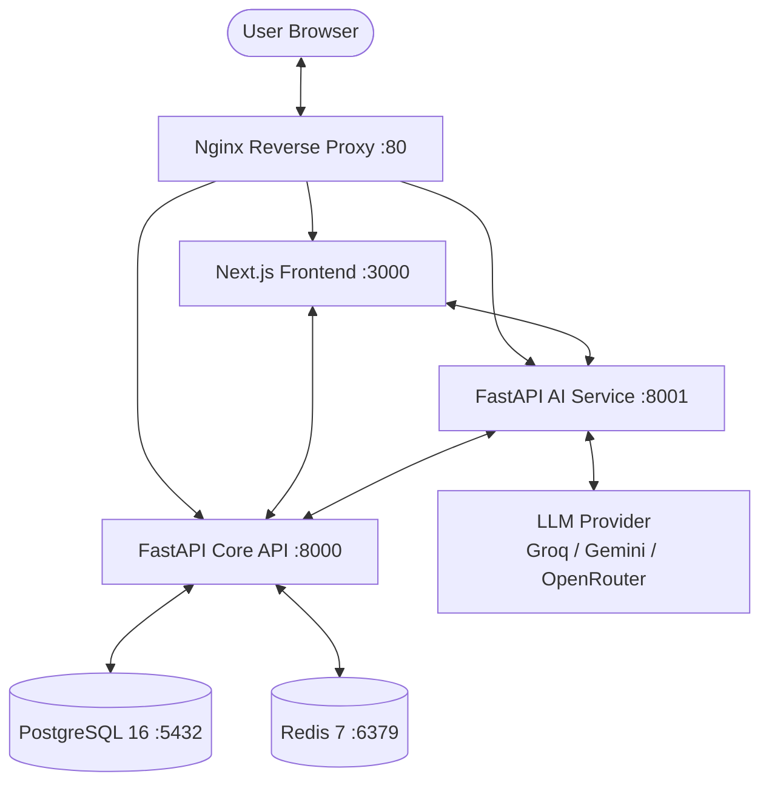

# EdXplore — Academic Workspace & AI Assistant

**EdXplore** is a production-ready, microservices-based student management system with a built-in context-aware AI Academic Assistant. It enables institutions to manage students, faculty, attendance, results, and timetables through a unified, role-aware web dashboard.

---

## Architecture

EdXplore is structured as a decoupled microservices stack orchestrated via Docker Compose, reverse-proxied through Nginx.



| Service | Port | Purpose |
| :--- | :--- | :--- |
| Nginx | 80 | Reverse proxy and ingress router |
| Frontend | 3000 | Next.js web application |
| Backend | 8000 | Core REST API (FastAPI) |
| AI Service | 8001 | AI academic assistant (FastAPI + LangChain) |
| PostgreSQL | 5432 | Primary relational database |
| Redis | 6379 | Rate limiting and session cache |

---

## Features

### Multi-Role Access Control (RBAC)
- **Admin** — Institution-wide management: user provisioning, bulk imports, audit log access, full CRUD on all entities.
- **Teacher** — Mark attendance, manage results for assigned subjects, view department rosters, use the AI assistant for operational actions.
- **Student** — Personal dashboard with attendance tracking, grade history, weekly timetable, and AI academic support.

### AI Academic Assistant ("Ask Xplore")
- **Context-aware**: Personalized to the logged-in user — student records, teacher assignments, or admin overviews.
- **Natural language queries**: Ask "What are my weak subjects?", "Show attendance for May", "How many students are below 75%?"
- **Actionable commands**: For teachers, generates pre-structured attendance-marking actions pending approval.
- **Swappable LLM backends**: Groq (Llama 3.3), Google Gemini, or OpenRouter.

### Academic Operations
- **Attendance tracking** with per-subject percentage calculations and risk alerts.
- **Grade management** with bulk `.xlsx` upload support and individual mark entry.
- **Dynamic timetable** with clash detection and faculty assignment.
- **Analytics dashboards** — KPI tiles for admins and personal snapshots for students.
- **Audit logging** — All data mutations tracked and queryable.
- **Custom SQL queries** — RBAC-enforced SELECT-only analytics endpoint.

### Visitor Analytics & Click Tracking
- **Automatic request logging** — Every API request is captured in the background without adding latency.
- **Visitor statistics** — Running totals for total visits and unique visitors (by IP address).
- **Period breakdowns** — Today, this week, and this month visit counts on demand.
- **Click logs** — Per-request log with IP, user agent, endpoint, HTTP method, status code, and authenticated user.
- **Top routes & IPs** — Ranked endpoint and IP activity for traffic analysis.
- All analytics endpoints are **admin-only** and available at `/analytics`.

---

## Tech Stack

| Layer | Technology |
| :--- | :--- |
| Frontend | Next.js 15, React 19, Tailwind CSS 4, TypeScript, Axios |
| Backend API | FastAPI 0.115, SQLAlchemy 2, Pydantic 2, Alembic, Python |
| AI Engine | FastAPI, LangChain 0.2, LLM (Groq / Gemini / OpenRouter) |
| Database | PostgreSQL 16 |
| Cache | Redis 7 |
| Infrastructure | Docker Compose, Nginx, Makefile |

---

## Quick Start (Docker)

### Prerequisites
- [Docker Desktop](https://www.docker.com/products/docker-desktop/) (includes Docker Compose v2)
- An LLM API key from one of: [Groq](https://console.groq.com), [Google AI Studio](https://aistudio.google.com), or [OpenRouter](https://openrouter.ai)

### 1. Clone and configure

```bash
git clone <repo-url>
cd student-management-ai
cp .env.example .env
```

Open `.env` and set these required values:

```ini
JWT_SECRET=<generate a long random string>
POSTGRES_PASSWORD=<choose a database password>
DATABASE_URL=postgresql+psycopg2://student_admin:<POSTGRES_PASSWORD>@db:5432/student_management
BACKEND_API_TOKEN=<generate a shared internal token>

# Choose one LLM provider and supply its key:
LLM_PROVIDER=openrouter          # groq | gemini | openrouter
LLM_MODEL=google/gemini-flash-1.5
OPENROUTER_API_KEY=<your key>
# GROQ_API_KEY=<your key>
# GEMINI_API_KEY=<your key>
```

### 2. Start the stack

```bash
make up
# or: docker compose up -d --build
```

Wait ~30 seconds for all health checks to pass, then open [http://localhost](http://localhost).

### 3. Bootstrap the first admin account

This endpoint works exactly once on a fresh database:

```bash
# Linux / macOS
curl -X POST http://localhost:8000/auth/bootstrap-admin \
  -H "Content-Type: application/json" \
  -d '{"email":"admin@example.com","password":"ChangeMe123!"}'

# Windows (PowerShell)
Invoke-RestMethod -Method Post http://localhost:8000/auth/bootstrap-admin `
  -ContentType "application/json" `
  -Body '{"email":"admin@example.com","password":"ChangeMe123!"}'
```

### 4. Load sample data (optional)

Seeds 100+ students, faculty, subjects, attendance records, and results:

```bash
make migrate-upgrade
docker compose exec backend python -m app.seed_sample_data --reset-sample
```

---

## Manual Setup (Local Development)

If you prefer running services outside Docker:

**Backend / AI Service:**
```bash
cd backend          # or: cd ai-service
python -m venv venv
source venv/bin/activate   # Windows: venv\Scripts\activate
pip install -r requirements.txt
uvicorn app.main:app --reload --port 8000   # AI Service: --port 8001
```

**Frontend:**
```bash
cd frontend
npm install
npm run dev
```

Set `NEXT_PUBLIC_BACKEND_URL=http://localhost:8000` and `NEXT_PUBLIC_AI_SERVICE_URL=http://localhost:8001/ai` in your `.env` or shell before running the frontend.

---

## Environment Variables

| Variable | Required | Default | Description |
| :--- | :---: | :--- | :--- |
| `POSTGRES_DB` | Yes | `student_management` | Database name |
| `POSTGRES_USER` | Yes | `student_admin` | Database user |
| `POSTGRES_PASSWORD` | Yes | — | Database password |
| `DATABASE_URL` | Yes | — | Full PostgreSQL connection string |
| `REDIS_URL` | Yes | `redis://redis:6379/0` | Redis connection string |
| `JWT_SECRET` | Yes | — | Secret key for JWT signing |
| `ACCESS_TOKEN_EXPIRE_MINUTES` | No | `60` | JWT token lifetime |
| `MIN_PASSWORD_LENGTH` | No | `8` | Minimum password length |
| `BACKEND_CORS_ORIGINS` | Yes | `http://localhost:3000,...` | Comma-separated allowed origins |
| `BACKEND_API_TOKEN` | Yes | — | Shared secret for AI service → Backend calls |
| `LLM_PROVIDER` | Yes | `openrouter` | LLM backend: `groq`, `gemini`, or `openrouter` |
| `LLM_MODEL` | Yes | `google/gemini-flash-1.5` | Model identifier for the chosen provider |
| `OPENROUTER_API_KEY` | Conditional | — | Required if `LLM_PROVIDER=openrouter` |
| `GROQ_API_KEY` | Conditional | — | Required if `LLM_PROVIDER=groq` |
| `GEMINI_API_KEY` | Conditional | — | Required if `LLM_PROVIDER=gemini` |
| `NEXT_PUBLIC_BACKEND_URL` | Yes | `http://localhost:8000` | Frontend → Backend URL (browser-visible) |
| `NEXT_PUBLIC_AI_SERVICE_URL` | Yes | `http://localhost:8001/ai` | Frontend → AI Service URL (browser-visible) |
| `ATTENDANCE_TARGET_PERCENT` | No | `75` | Attendance warning threshold (%) |
| `CLASS_DURATION_MINUTES` | No | `45` | Default class slot duration |
| `UPLOAD_MAX_BYTES` | No | `5000000` | Max file size for bulk imports (5 MB) |
| `LOGIN_RATE_LIMIT_COUNT` | No | `10` | Max login attempts per window |
| `LOGIN_RATE_LIMIT_WINDOW_SECONDS` | No | `60` | Rate limit window in seconds |
| `AUTO_CREATE_TABLES` | No | `false` | Auto-create tables on startup (use Alembic instead) |

---

## API Documentation

| Service | URL |
| :--- | :--- |
| Backend Swagger UI | [http://localhost:8000/docs](http://localhost:8000/docs) |
| Backend ReDoc | [http://localhost:8000/redoc](http://localhost:8000/redoc) |
| AI Service Health | [http://localhost:8001/health/live](http://localhost:8001/health/live) |

The full API reference — including all analytics endpoints — is documented in [PROJECT_DOCUMENTATION.md](./PROJECT_DOCUMENTATION.md#6-api-reference).

---

## Makefile Reference

| Command | Description |
| :--- | :--- |
| `make up` | Start development containers in background |
| `make down` | Stop and remove containers and networks |
| `make build` | Rebuild all Docker images |
| `make logs` | Stream logs from all services (last 150 lines) |
| `make ps` | Show container status |
| `make up-prod` | Start production stack |
| `make down-prod` | Stop production stack |
| `make logs-prod` | Stream production logs |
| `make migrate-create` | Generate new Alembic migration from model changes |
| `make migrate-upgrade` | Apply pending database migrations |
| `make backend-tests` | Run backend test suite |
| `make ai-tests` | Run AI service test suite |
| `make fmt` | Auto-fix and format code with ruff |
| `make lint` | Lint backend code with ruff |
| `make bootstrap-admin` | Create first admin account (reads env vars) |

---

## Project Structure

```
student-management-ai/
├── backend/                  # Core REST API (FastAPI + PostgreSQL)
│   ├── alembic/              # Database migration scripts
│   └── app/
│       ├── core/             # Auth, security, DB engine, middleware
│       ├── models/           # SQLAlchemy ORM models
│       ├── routes/           # API endpoint routers
│       ├── schemas/          # Pydantic request/response schemas
│       └── services/         # Business logic layer
├── ai-service/               # AI Assistant microservice (FastAPI + LangChain)
│   └── app/
│       ├── agents/           # Backend API integration agents
│       ├── chains/           # Intent analysis and routing chains
│       ├── routes/           # /query and /health endpoints
│       ├── services/         # LLM client, RAG context builder
│       └── tools/            # Attendance and grade math utilities
├── frontend/                 # Web dashboard (Next.js 15)
│   ├── components/           # Reusable React components
│   ├── context/              # Auth state (JWT + user context)
│   ├── lib/                  # Axios instances, type declarations
│   └── pages/                # Next.js file-based routes
├── docker/                   # Dockerfiles and Nginx config
├── .env.example              # Environment variable template
├── docker-compose.yml        # Development stack
├── docker-compose.prod.yml   # Production stack
├── Makefile                  # Developer CLI
└── PROJECT_DOCUMENTATION.md  # Full technical documentation
```

---

## Troubleshooting

**502 Bad Gateway**
Nginx started before the upstream service was ready. Wait 30 seconds and refresh. Check `make logs` for startup errors.

**Frontend shows blank or crashes**
Run `make logs` and look for the `frontend` service. In development mode it hot-reloads; watch for TypeScript compile errors.

**CORS errors in browser**
Ensure `BACKEND_CORS_ORIGINS` in `.env` includes the exact URL you are using (protocol + hostname + port). Restart the backend after changing it.

**AI responses are empty or error**
Verify `LLM_PROVIDER` and the corresponding API key in `.env`. The AI service logs (`make logs`) show LLM request errors.

**Database connection refused**
The `db` service may not have finished initializing. Check `make ps` — the `db` container should show `healthy`. Run `make migrate-upgrade` after it is healthy.

**Bootstrap admin fails with "Admin already exists"**
The bootstrap endpoint is one-time only. Use the admin login with your configured credentials, or connect directly to PostgreSQL to reset.

---

## License

This project is for educational and internal use. See the repository for full license details.
